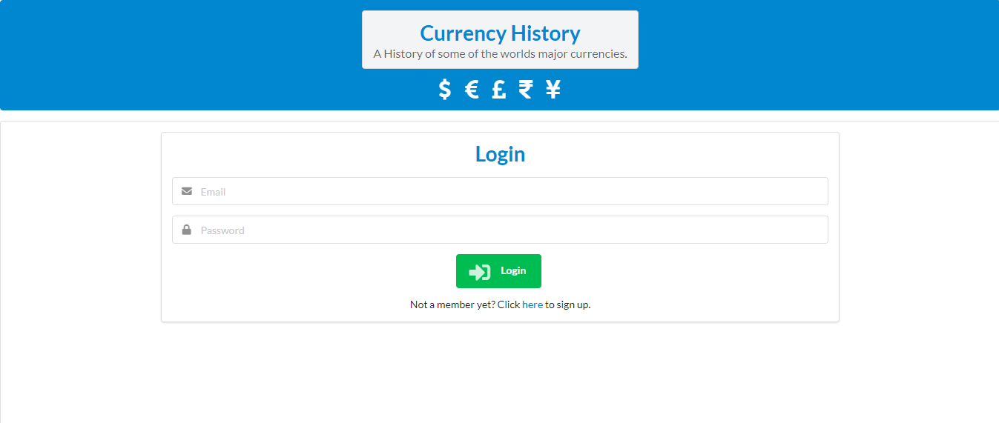

<h1>The History of Currency</h1>

**This app has some information about the history of currency around the world and a quiz at the bottom based on the information provided above. It also connects to an API (found <a target="blank" href="https://exchangeratesapi.io/">here</a>) to show the user live information about the values of 6 currencies.**

**To use this app you'll need to clone the repo using `git clone https://github.com/HarryH-Tech/Currency-App.git`.   Then navigate into the Currency-App directory and run npm install. You'll need to sign up for a firebase account, if you don't already have one and create a new app within the firebase console. After doing this you'll need to update the firebaseConfig object in the `firebase.js` file in the src folder with the config object from your own firebase project (more information about this can be found here https://support.google.com/firebase/answer/7015592). Then run npm run start and you should see the screen below.   I hope you enjoy using this app 😊**

